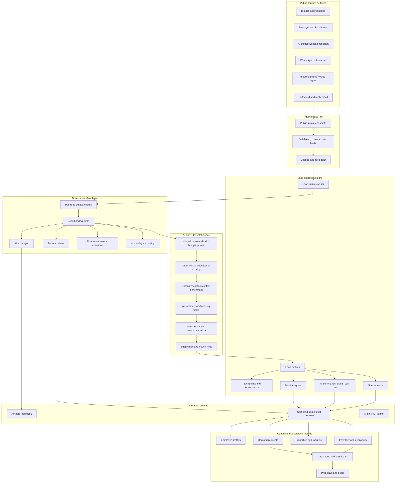
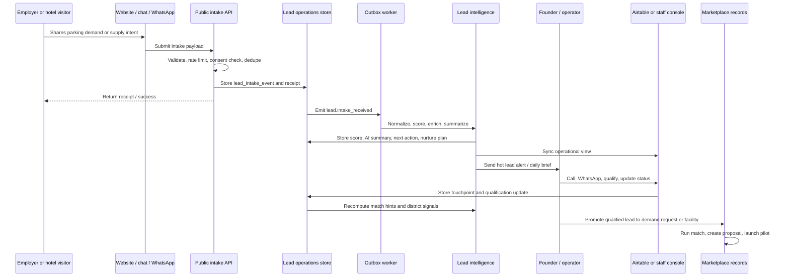
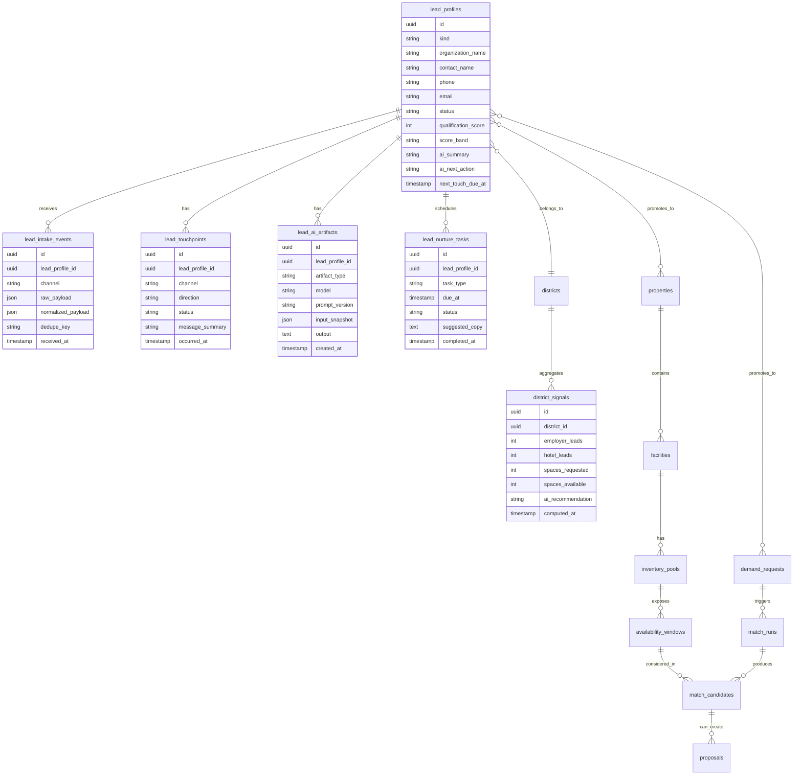
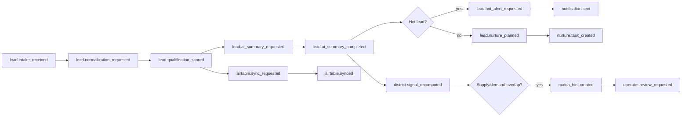
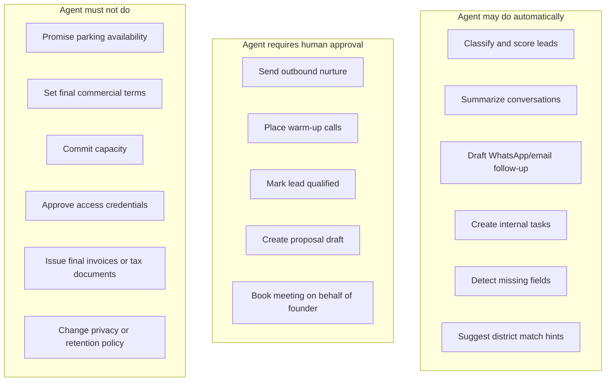

# Parqo AI-Native GTM Platform Architecture

Status: Recommended high-level target architecture  
Date: 2026-07-09

## 1. Objective

Turn the acquisition website into an AI-native GTM platform that captures employer demand and hotel/facility supply, qualifies and nurtures leads, keeps humans in control of commercial decisions, and surfaces district-level pilot opportunities.

The key shift is from a static website-to-Airtable flow to a durable lead operations platform:

```text
Capture intent → enrich and qualify → recommend next action → nurture → match supply and demand → promote to marketplace records
```

## 2. Platform view



## 3. Lead lifecycle



## 4. Data model extension



## 5. Event and workflow model



Recommended initial event types:

- `lead.intake_received`
- `lead.qualification_scored`
- `lead.ai_summary_requested`
- `lead.ai_summary_completed`
- `lead.hot_alert_requested`
- `lead.nurture_planned`
- `lead.followup_overdue`
- `airtable.sync_requested`
- `district.signal_recomputed`
- `match_hint.created`
- `operator.review_requested`

## 6. Agent authority model



## 7. Recommended implementation phases

### Phase 1: Intelligence inside current stack

- Keep the current public website and Airtable workflow.
- Add AI summary, deterministic score explanation, next action, and suggested WhatsApp/email copy.
- Store these outputs in Airtable metadata fields and founder notifications.

### Phase 2: Durable lead operations store

- Add Postgres tables for lead profiles, intake events, touchpoints, AI artifacts, nurture tasks, and district signals.
- Make Airtable a synced operator view rather than the source of truth.
- Add outbox events for enrichment, notifications, Airtable sync, and nurture.

### Phase 3: Staff lead and district console

- Build `/staff/leads`, `/staff/districts`, `/staff/matches`, and `/staff/nurture`.
- Promote qualified leads into canonical demand requests, properties, facilities, inventory, and availability windows.

### Phase 4: Conversational and multi-channel agents

- Add an AI guided website assistant.
- Add WhatsApp/email nurture agents with human approval.
- Add voice qualification only after consent, conversation storage, and authority controls exist.
